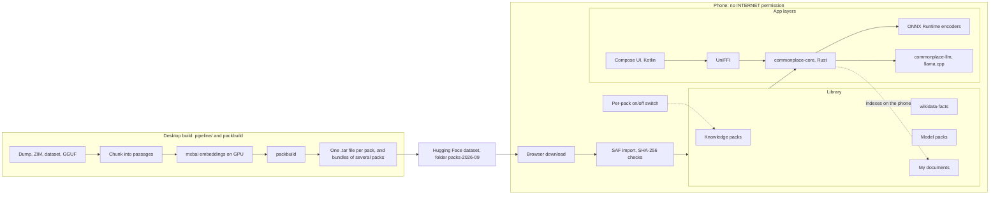
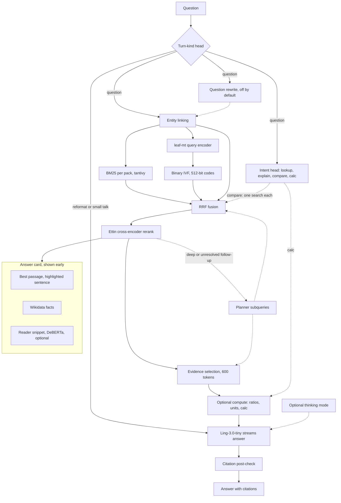

# Commonplace

An offline research assistant for Android. It answers questions from a library of Wikipedia and other reference text on the phone. It cites every claim. It never uses the network: the app has no `INTERNET` permission.

I built it for the poidh bounty "Build the Best Offline AI Research App for Android". The target hardware is a Google Pixel with GrapheneOS, 12 GB of RAM and no Google Play Services.

## How it works

A naive design spends the phone's compute on raw Wikipedia text at query time. Commonplace prepares the text ahead of time on a desktop. The phone mostly looks things up.

### System overview

The desktop builds the packs. The phone imports them from files and never uses the network. In Library, each knowledge pack and the Wikidata pack has an on/off switch, and "My documents" indexes a PDF, text or Markdown file on the phone.



### From a question to a cited answer

The answer card appears after the rerank, before the model writes a word. The intent head and the turn-kind head are small classifiers on the leaf-mt embedding of the question. The turn-kind head needs the language model. Without it, every message counts as a question.



### Design choices

1. **Search in about one second.** Keyword search (tantivy BM25) and semantic search run in parallel. The semantic index holds 512-bit binary codes in an IVF index, and the 23M-parameter leaf-mt encoder embeds the question. Reciprocal-rank fusion merges the two lists. The Ettin-17m cross-encoder reranks the top 24 fused passages on the phone (with an 8-bit copy of the model) and the top 40 on the desktop.
2. **An instant answer card.** The best passage, Wikidata facts and the source list appear before the model writes a word. The matching sentence is highlighted. For simple lookups, an extractive reader adds a short snippet.
3. **A small model writes the answer.** Ling-3.0-tiny (7.9B total and 1.3B active parameters, MIT) runs fully in RAM through llama.cpp. It reads compact evidence, not whole articles. The app caches the state of the system prompt, so each question only pays for its own evidence.
4. **Checks in code, not in a second model.** The app removes citations to sources that do not exist. It underlines sentences with numbers that are not in the evidence. Unit conversions and Wikidata ratios run in code. For an explicit calculation, the model writes an expression and code evaluates it.
5. **Comparisons and follow-ups.** A comparison runs one search for each item. A follow-up uses the earlier turns. A turn such as "make it shorter" rewrites the last answer and does not search.
6. **Thinking mode.** The brain button next to the question box lets Ling reason before it answers. The default budget is 256 tokens, and you can change it in Settings.

The app also has voice input (Moonshine, on device), a History screen and a reader for passages and articles.

The question rewrite step ("Understand the question first" in Settings) is off by default. It fixes typos and follow-ups, and it adds a few seconds.

## Status (2026-10-02)

| Part | State |
|---|---|
| Rust core: packs, hybrid retrieval, rerank, orchestration, citations, tools, telemetry | Works on desktop and Android |
| Desktop CLI (`commonplace ask / retrieve / bench / serve-eval`) | Works |
| Android app (Compose) | Runs on a Pixel 10 (GrapheneOS, Android 17, 12 GB) and in the emulator. `scripts/e2e_emulator.py` drives the emulator build. |
| Packs | Built on the desktop (2026-10-02): English Wikipedia of 2026-09-01, Wikidata facts and 15 breadth packs ([docs/DATASETS.md](docs/DATASETS.md)). Published in the `packs-2026-09` folder of the Hugging Face dataset [`0xPD33/commonplace-packs`](https://huggingface.co/datasets/0xPD33/commonplace-packs). |
| Pixel 10 speed | Card median 0.91 s, first word about 7 s, Ling decode about 18 tok/s on a cool phone and 8-11 tok/s on a hot phone ([docs/BENCHMARKS.md](docs/BENCHMARKS.md)) |
| Quality (63 seed questions, desktop) | Score ratio 0.52 against Claude with web search ([docs/EVAL.md](docs/EVAL.md)) |
| LiteRT-LM engine (Gemma 4 E2B) | Works on the CPU. The Tensor G5 NPU path is blocked by a library version mismatch. |
| Not done | A heat test over many questions is open. |

## Try it

- **Phone:** download the Starter set (one file, 11.3 GB), then tap Install from Downloads in the app. See [docs/INSTALL.md](docs/INSTALL.md).
- **Desktop CLI:**
  ```sh
  nix develop            # or install the tools listed in docs/INSTALL.md
  scripts/fetch-models.sh encoders llm-fast
  cd core && cargo build --release -p commonplace-cli -p packbuild && cd ..
  core/target/release/commonplace --model data/models/llm/Ling-3.0-tiny-Q4_0.gguf ask "Why is the sky blue?"
  ```
  The CLI reads packs from `data/library/packs/`. To install a downloaded pack or bundle there, run `tar -xf <file>.tar -C data/library/packs`. [docs/PACKS.md](docs/PACKS.md) shows how to build packs.

## Repository

| Path | Contents |
|---|---|
| `core/` | Rust workspace: `commonplace-core`, `commonplace-llm` (llama.cpp FFI), `commonplace-ffi` (UniFFI), `commonplace-cli`, `packbuild` |
| `android/` | Kotlin and Jetpack Compose app |
| `pipeline/` | Python build steps: Wikipedia dump conversion, breadth pack converters, Wikidata, dense codes, reranker distillation |
| `eval/` | Evaluation harness (Claude with web search as the baseline and judge) and the cited runs |
| `scripts/` | Model and data downloads, Android build, emulator, E2E driver, dev push, release |
| `docs/` | [INSTALL](docs/INSTALL.md), [MODELS](docs/MODELS.md), [DATASETS](docs/DATASETS.md), [PACKS](docs/PACKS.md), [BENCHMARKS](docs/BENCHMARKS.md), [EVAL](docs/EVAL.md) |
| `third_party/llama.cpp` | Pinned submodule (`b11240`) |

## License

Code: Apache-2.0 ([LICENSE](LICENSE)). The pack and model licenses differ from the license of the code. Each pack and each model keeps the license of its source: for example Wikipedia is CC BY-SA 4.0 and GFDL, Wikidata is CC0, Ling-3.0-tiny is MIT, and LFM2.5 is under the LFM Open License v1.0, which allows commercial use only below US$10M annual revenue. Every pack and model carries its credit, license notice and license text in a `NOTICE.txt` (sources in [pipeline/notices](pipeline/notices)). [docs/DATASETS.md](docs/DATASETS.md) lists the license of each pack. The open-source licenses of the app itself are in Settings > Open-source licenses. `scripts/licenses.py` generates that list (`android/app/src/main/assets/third_party_licenses.txt`) from the Rust dependency graph, the Gradle dependencies, the native code, the bundled models and the font. Model licenses are in [docs/MODELS.md](docs/MODELS.md).
