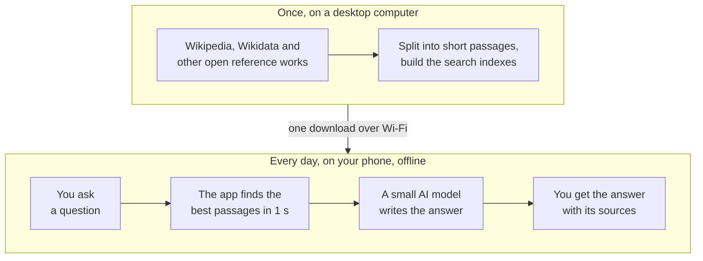
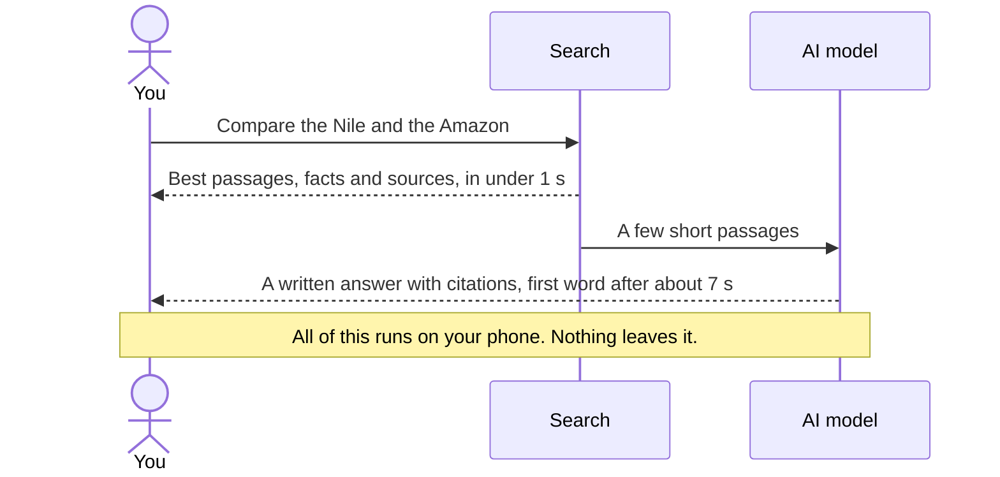
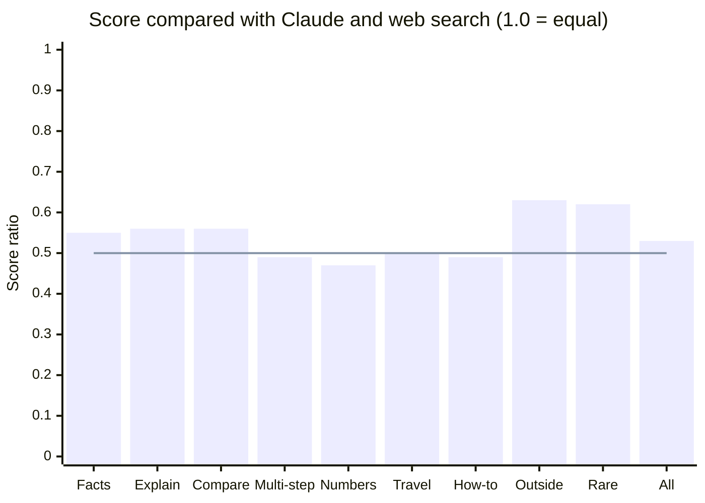
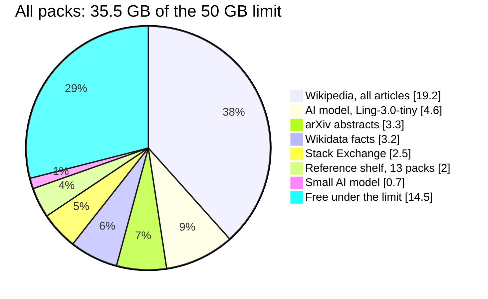
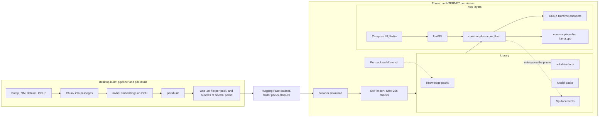
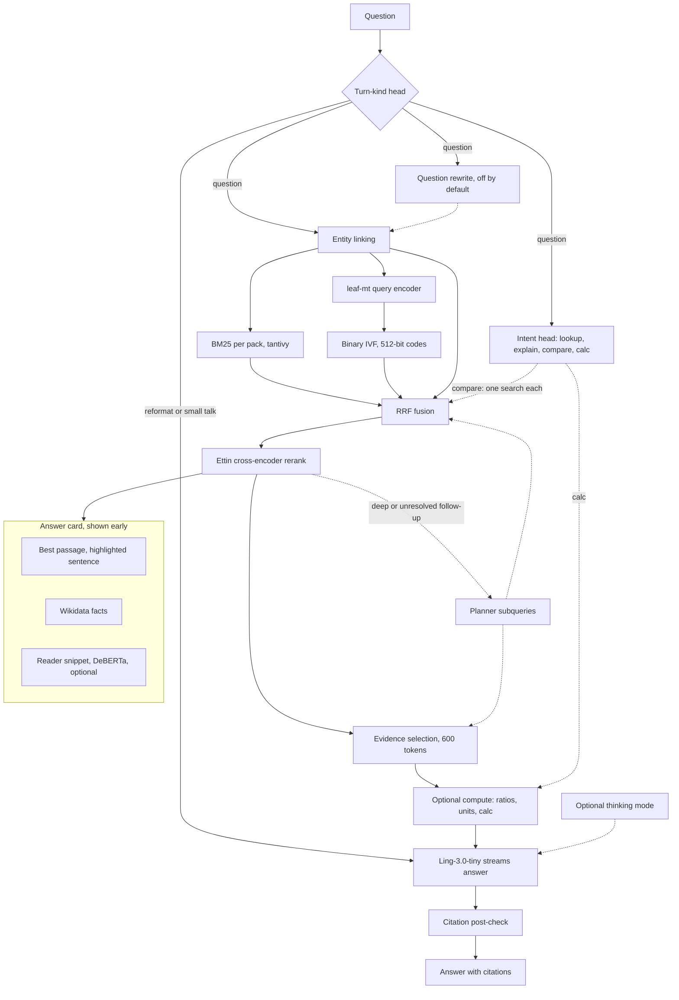

# Commonplace

Commonplace is an offline research assistant for Android. You ask a question, and it answers from Wikipedia and other reference text stored on your phone. Every answer cites its sources. The app has no `INTERNET` permission, so it cannot use the network.

I built it for the poidh bounty [Build the Best Offline AI Research App for Android](https://poidh.xyz/mainnet/bounty/31). I test it on a Google Pixel 10 with GrapheneOS and 12 GB of RAM.

[The idea](#the-idea) · [Install on a phone](#install-on-a-phone) · [Bounty requirements](#bounty-requirements) · [Under the hood](#under-the-hood) · [Packs on Hugging Face](https://huggingface.co/datasets/0xPD33/commonplace-packs) · [Build from source](docs/INSTALL.md#build-from-source)

[](docs/media/commonplace-showcase.mp4)

*A 95-second tour with sound, recorded on a Pixel 10 ([MP4, 17 MB](docs/media/commonplace-showcase.mp4)). The video speeds up the waits and shows each speed-up on screen.*

## The idea

A phone is too slow to read Wikipedia for every question. So a desktop computer does the reading once: it splits the text into short passages and builds search indexes for them. You download the result one time. After that, your phone only looks things up and writes a short answer from what it finds.



## What happens when you ask

You see the best passage and its source in under a second. The written answer follows a few seconds later. The answer cites the passages it uses, and you can open each one to check it.



## Offline by design

You do not have to trust a setting. Android itself blocks the network for Commonplace, because the app does not ask for the `INTERNET` permission. You download the packs once with your browser, and the app imports them from the Downloads folder.


## Install on a phone

You need:

- An Android phone with a 64-bit ARM CPU and Android 12 or later. Google Play Services are not necessary.
- 12 GB of RAM for the main model. On a phone with 8 GB, use the small model (see [docs/INSTALL.md](docs/INSTALL.md#more-packs)).
- About 23 GB of free storage for the first import. After the import, the app uses 11.3 GB.
- A Wi-Fi connection for one download of 11.3 GB.

Steps:

1. On the phone, open the [latest release](https://github.com/0xPD33/commonplace/releases/latest) and download `commonplace-<version>.apk`. Open the file and install the app.
2. Open Commonplace and tap **Open Library**. Under **Get more**, tap **Starter set**, then tap **Download**. The browser saves `commonplace-starter.tar` (11.3 GB) in **Downloads**.
3. When the download is complete, tap **Install from Downloads** in the Library. Tap `commonplace-starter.tar`. The app checks every byte with SHA-256 while it copies the file.
4. When the app asks, tap **Delete** to remove the downloaded file.
5. Go back and ask a question. The first question is slower, because the app loads the model into memory.

To check that the app is offline, turn on airplane mode. Or open **Settings > Apps > Commonplace > Permissions**: the app has no network permission.

[docs/INSTALL.md](docs/INSTALL.md) has the other packs, the install from a computer and the build from source.

## Bounty requirements

| Requirement | How Commonplace meets it |
|---|---|
| Runs on Android and GrapheneOS hardware | I run it on a Pixel 10 with GrapheneOS (Android 17). The minimum is Android 12 on a 64-bit ARM CPU. |
| Works in a maximum of 12 GB of RAM | The peak memory of the app with the main model is 5.1 GB on the Pixel 10 ([BENCHMARKS](docs/BENCHMARKS.md)). |
| Uses no more than 50 GB in total | The Starter set uses 11.3 GB. All packs together use 35.5 GB, plus the app. The app refuses an import that takes the total above 50 GB. |
| Works offline, with no network requests during use | The APK has no `INTERNET` permission, so Android blocks all network access. The release script stops if the permission appears. You download the packs once with the browser. |
| No Google Play Services | The app uses no Google Play Services library: the APK contains no `com.google.android.gms` classes. |
| Explanation, comparison, synthesis and reasoning | A comparison runs one search for each item and computes ratios from Wikidata in code. Follow-up questions use the earlier turns. A thinking mode lets the model reason before it answers. |
| Usable speed on a phone | On the Pixel 10, the answer card with the best passage comes after 0.91 s (median). The first word of the written answer comes after about 7 s. The model then writes about 18 tokens per second. |
| Public GitHub repository with code, assets and instructions | This repository holds all code. The packs are on [Hugging Face](https://huggingface.co/datasets/0xPD33/commonplace-packs), and [docs/PACKS.md](docs/PACKS.md) shows how to build them again. |
| Documents the models, datasets and indexes | [MODELS](docs/MODELS.md), [DATASETS](docs/DATASETS.md) and [PACKS](docs/PACKS.md). |
| More than 50% as good as internet search with a frontier model | On 63 of my own questions, Commonplace gets 53% of the score of Claude Opus 5.5 with web search ([EVAL](docs/EVAL.md)). See the limits below. |

How I measure quality: Claude Opus 5.5 with web search answers each question as the baseline. A second Claude call grades both answers blind on correctness, completeness, grounding and usefulness. The score ratio is our mean score divided by the baseline's mean score.

Limits of this measurement:

- 63 questions is a small set. The ratio changes by about ±0.05 between two runs of the judge.
- The baseline wins almost every single question (61 losses, 2 ties). Commonplace gets half the points, not half the wins.
- Multi-step (0.49), how-to (0.49) and numeric questions (0.47) are below 0.50.
- The quality numbers come from the desktop build with the same model and all packs, including the full Wikipedia. I did not measure the Starter set alone.
- The phone uses an 8-bit copy of the reranker. In my tests it stays within 1 point of hit@1 of the full model.

### Quality by type of question

A score ratio of 1.0 means as good as Claude with web search. The line marks 0.5. "Outside" means questions whose answer is not in the packs. "Rare" means topics that few people read about. Each type has only 3 to 11 questions.



### What fits on the phone

The Starter set needs 11.3 GB. This chart shows the case with every pack installed, in GB.



## Under the hood

These two diagrams show the parts of the system and each step from a question to an answer.

<details>
<summary>Show the technical diagrams</summary>

### System overview

The desktop builds the packs. The phone imports them from files and never uses the network. In the Library, each knowledge pack and the Wikidata pack has an on/off switch. "My documents" indexes your own PDF, text or Markdown files on the phone.



### From a question to a cited answer

The answer card appears after the rerank, before the model writes a word. The intent head and the turn-kind head are small classifiers on the embedding of the question. The turn-kind head needs the language model. Without the model, every message counts as a question.



</details>

### Design choices

1. **Search in about one second.** Keyword search (tantivy BM25) and semantic search run in parallel. The semantic index holds 512-bit binary codes in an IVF index. The 23M-parameter leaf-mt encoder embeds the question. Reciprocal-rank fusion merges the two lists. The Ettin-17m cross-encoder then reranks the top 24 passages on the phone and the top 40 on the desktop.
2. **An answer card before the answer.** The best passage, Wikidata facts and the source list appear before the model writes a word. The app highlights the sentence that matches. For a simple lookup, an extractive reader adds a short snippet.
3. **A small model writes the answer.** Ling-3.0-tiny (7.9B parameters in total, 1.3B active for each token, MIT license) runs fully in RAM through llama.cpp. It reads short evidence, not whole articles. The app keeps the state of the system prompt in memory, so each question pays only for its own evidence.
4. **Checks in code, not in a second model.** The app removes citations to sources that do not exist, and a list of sources that the model writes at the end of an answer. It underlines sentences with numbers that are not in the evidence. Code does unit conversions and Wikidata ratios. For a calculation, the model writes an expression and code calculates the result.
5. **Comparisons and follow-ups.** A comparison runs one search for each item. When a name has several articles ("Mars"), the other names in the question and their Wikidata classes decide which one it means. A follow-up uses the earlier turns. A request such as "make it shorter" rewrites the last answer and does not search again.
6. **Thinking mode.** The brain button next to the question box lets Ling reason before it answers. The default budget is 256 tokens. Settings has a slider for the budget.
7. **Your own documents.** "My documents" turns a PDF, text or Markdown file into a small pack on the phone. Citations show the page. "Ask this document" limits a conversation to one document. PDF import needs Android 15, or Android 12 to 14 with the newest system updates.

The app also has a History screen and a reader for passages and articles. Each source shows its credit, license and URL. A question rewrite step ("Understand the question first" in Settings) is off by default: it fixes typos and follow-ups, but it adds a few seconds.

## Results on the Pixel 10

| Measure | Value |
|---|---|
| Answer card (search, rerank, best passage) | 0.91 s median |
| First word of the written answer | About 7 s |
| Writing speed | About 18 tokens/s on a cool phone, 8 to 11 tokens/s after the phone passes about 37 °C |
| Peak memory with the main model | 5.1 GB |

[docs/BENCHMARKS.md](docs/BENCHMARKS.md) has all measurements with their dates and builds.

Known limits:

- The phone gets slower when it gets hot. A long test of heat over many questions is still open.
- Multi-step and numeric questions are the weakest categories ([EVAL](docs/EVAL.md)).
- Voice input (Moonshine, on the phone) works only in developer builds, because the release does not include the voice model yet.
- The Tensor G5 NPU is not used. The LiteRT-LM library for it does not match the phone's runtime version.

## Desktop command line

The same Rust core runs on a desktop computer. The desktop build is the one that the evaluation uses.

```sh
nix develop            # or install the tools listed in docs/INSTALL.md
scripts/fetch-models.sh encoders llm-fast
cd core && cargo build --release -p commonplace-cli -p packbuild && cd ..
core/target/release/commonplace --model data/models/llm/Ling-3.0-tiny-Q4_0.gguf ask "Why is the sky blue?"
```

The command line reads packs from `data/library/packs/`. To install a pack or a bundle there, run `tar -xf <file>.tar -C data/library/packs`. [docs/PACKS.md](docs/PACKS.md) shows how to build packs.

## Repository

| Path | Contents |
|---|---|
| `core/` | Rust workspace: `commonplace-core`, `commonplace-llm` (llama.cpp bindings), `commonplace-ffi` (UniFFI), `commonplace-cli`, `packbuild` |
| `android/` | Kotlin and Jetpack Compose app |
| `pipeline/` | Python build steps: Wikipedia dump conversion, converters for the other packs, Wikidata, dense codes, license notices |
| `eval/` | Evaluation harness (Claude with web search as the baseline and the judge) and the runs that the docs cite |
| `scripts/` | Model and data downloads, Android build, emulator, end-to-end test driver, release |
| `docs/` | [INSTALL](docs/INSTALL.md), [MODELS](docs/MODELS.md), [DATASETS](docs/DATASETS.md), [PACKS](docs/PACKS.md), [BENCHMARKS](docs/BENCHMARKS.md), [EVAL](docs/EVAL.md) |
| `third_party/llama.cpp` | llama.cpp at tag `b11240` (git submodule) |

## License

The code is under Apache-2.0 ([LICENSE](LICENSE)).

The packs and models keep the licenses of their sources. For example, Wikipedia is CC BY-SA 4.0 and GFDL, Wikidata is CC0, and Ling-3.0-tiny is MIT. LFM2.5 uses the LFM Open License v1.0, which allows commercial use only below US$10M of annual revenue.

- Each pack contains a `NOTICE.txt` with its credit, license and full license texts. The sources of these files are in [pipeline/notices](pipeline/notices).
- [docs/DATASETS.md](docs/DATASETS.md) lists the license of each pack. [docs/MODELS.md](docs/MODELS.md) lists the license of each model.
- The app shows the licenses of its own dependencies in **Settings > Open-source licenses**. `scripts/licenses.py` makes that list.
